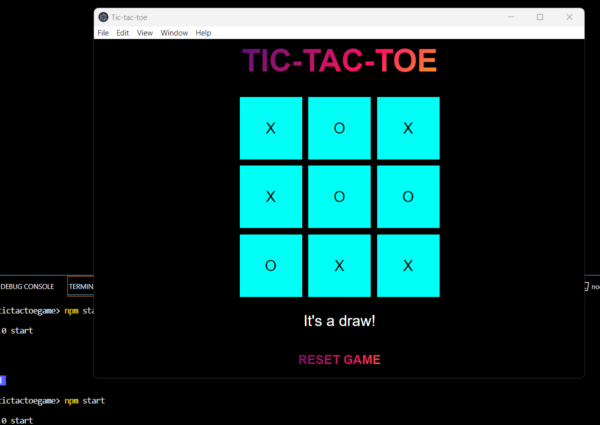

# Tic-Tac-Toe Desktop Game

## Overview

The Tic-Tac-Toe Desktop Game is a simple and interactive cross-platform application developed using Electron. This project brings the classic Tic-Tac-Toe game to your desktop, providing a seamless gaming experience.

## Prerequisites

Before running the application, make sure you have the following installed:

- [Node.js](https://nodejs.org/en/download/)
- [Visual Studio Code (VS Code)](https://code.visualstudio.com/download/)

## Installation

1. Un Zip  the file

2. Navigate to the project directory.

```bash
cd tic-tac-toe-desktop
```

3. Install dependencies.

```bash
npm install
```

## Usage

1. Launch the application.

```bash
npm start
```

2. The Tic-Tac-Toe game window will open on your desktop.

## How to Play

- Click on the cells to make your move.
- The game will alternate between player (X) and computer (O) moves.
- The first player to get three in a row wins!


## Credits

This project was built using Electron and various web technologies. Special thanks to the open-source community for their valuable contributions.

